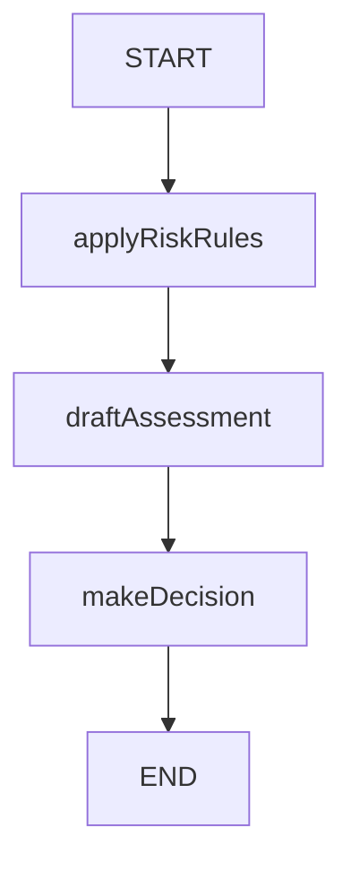

# Sentinel Fraud Detection Agent

Sentinel is an intelligent fraud detection agent built using the LangGraph framework. It leverages a state machine approach to process transactions through a series of risk assessment steps, applying business rules, drafting risk assessments, and making final decisions. The modular design allows for easy extension and robust error handling, making it suitable for real-world financial risk management scenarios.

## How It Works

The core of Sentinel is a directed graph (LangGraph) that models the fraud detection workflow as a sequence of nodes. Each node represents a processing step, and edges define the flow of data and decisions. The workflow is persistent, allowing for state saving and recovery.

### Workflow Steps

1. **START**: Entry point of the workflow.
2. **applyRiskRules**: Applies risk rules to the input data.
3. **draftAssessment**: Drafts a risk assessment based on the rules applied.
4. **makeDecision**: Makes a final decision (e.g., approve, flag, or deny).
5. **END**: Workflow completion.

## LangGraph Diagram

Below is a diagram representing the flow of the fraud detection agent:



## Getting Started

1. **Install dependencies:**
   ```bash
   npm install
   ```
2. **Run the agent:**
   ```bash
   npm run dev
   ```

## The Rules Engine: The Brain of Sentinel

At the heart of Sentinel is a powerful rules engine, which acts as the system's brain for fraud detection. The rules engine evaluates every transaction against a comprehensive set of regulatory and internal policy rules, inspired by CBN regulations and best practices in fintech risk management.

### How the Rules Engine Works

- **Rulebook Driven:** All rules are defined in a structured rulebook, including regulatory, policy, AML/CTF, velocity, and behavioral anomaly checks.
- **Dynamic Evaluation:** Each transaction is checked against relevant rules using flexible condition logic (e.g., greater than, between, equals, not equals, etc.), supporting nested and compound conditions.
- **Context-Aware:** The engine supports dynamic checks, such as KYC tier limits, transaction velocity, behavioral anomalies, and more, adapting to user history and transaction context.
- **Extensible:** New rules can be added or existing ones updated without changing the core engine logic, making it easy to adapt to evolving regulatory or business needs.

The rules engine is implemented in `src/utils/rule-engine.ts` and is responsible for:

- Enforcing CBN and internal policy limits
- Detecting suspicious patterns (e.g., structuring, odd hours, new account risks)
- Flagging high-risk transactions for further review or action

This modular and robust approach ensures Sentinel can provide accurate, explainable, and auditable fraud detection for modern fintech applications.

## Project Structure

- `src/agent.ts`: Defines the LangGraph workflow for fraud detection.
- `src/utils/`: Contains node logic, the rules engine, and state definitions.

## License

MIT
