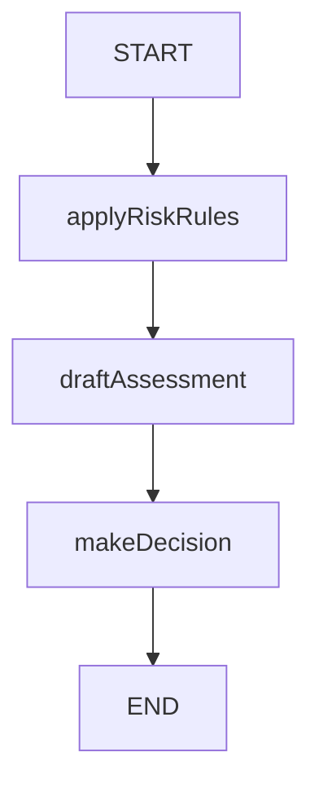

# Sentinel Fraud Detection Agent

Sentinel is an intelligent fraud detection agent built using the LangGraph framework. It leverages a state machine approach to process transactions through a series of risk assessment steps, applying business rules, drafting risk assessments, and making final decisions. The modular design allows for easy extension and robust error handling, making it suitable for real-world financial risk management scenarios.

## How It Works

The core of Sentinel is a directed graph (LangGraph) that models the fraud detection workflow as a sequence of nodes. Each node represents a processing step, and edges define the flow of data and decisions. The workflow is persistent, allowing for state saving and recovery.

### Workflow Steps

1. **START**: Entry point of the workflow.
2. **applyRiskRules**: Applies risk rules to the input data.
3. **draftAssessment**: Drafts a risk assessment based on the rules applied.
4. **makeDecision**: Makes a final decision (e.g., approve, flag, or deny).
5. **END**: Workflow completion.

## LangGraph Diagram

Below is a diagram representing the flow of the fraud detection agent:



## Getting Started

1. **Install dependencies:**
   ```bash
   npm install
   ```
2. **Run the agent:**
   ```bash
   npm run dev
   ```

## Project Structure

- `src/agent.ts`: Defines the LangGraph workflow for fraud detection.
- `src/utils/`: Contains node logic and state definitions.

## License

MIT
